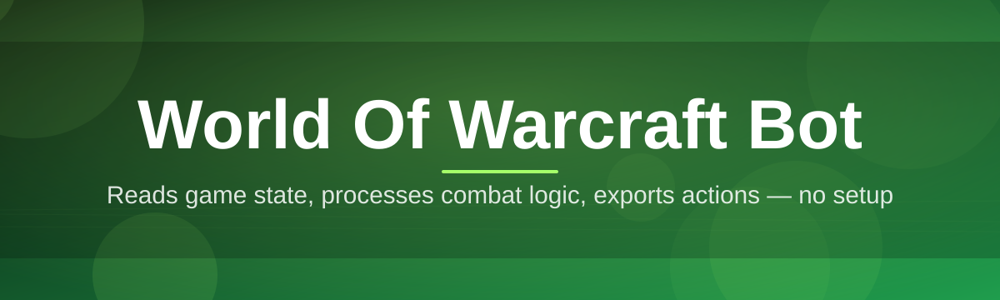
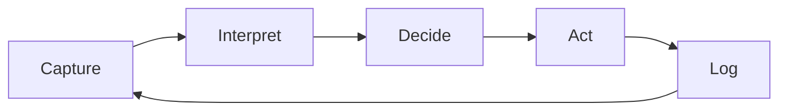

# wow-bot-companion 🐉⚔️

  

*Your tireless second set of hands in Azeroth — automate the grind, keep the adventure.*

  

## 🧭 Overview

Leveling alts, farming reputation, running the same daily circuit fifty times — the repetitive backbone of World of Warcraft eats hours that could go toward raiding, PvP, or actually enjoying the story. **wow-bot-companion** exists to reclaim that time. It's a standalone Windows companion that watches game state, makes decisions, and executes routines so the tedious 80% of play runs itself while you focus on the 20% that's actually fun.

This project was built by players who got tired of choosing between "grind manually" and "quit playing altogether." Gatherers who want full node maps without tab-alting to a browser, altoholics who want ten characters geared without ten repeated afternoons, and roleplayers who just want their mount macros to feel alive — this tool is for all of them. It's not a magic win button; it's a configurable automation layer that respects how *you* want to play.

Under the hood, wow-bot-companion focuses on efficiency, stability, and low footprint. No background services phoning home, no bloated overlays fighting your GPU for frames — just a lightweight companion app that sits beside the game client and does exactly what you tell it to.

> [!NOTE]
> wow-bot-companion is a third-party companion tool. It is not affiliated with, endorsed by, or connected to Blizzard Entertainment.

---

## ⚡ What It Actually Does

- **Route Weaver** — builds and follows farming/leveling paths across zones, adapting on the fly when mobs, terrain, or other players get in the way.

- **Loot Sentinel** — auto-detects lootable corpses, chests, and herbs/ore nodes within range and queues interaction without breaking your combat rotation.

- **Rotation Assist** — a configurable priority system for ability usage per spec, tunable down to cooldown thresholds and resource pooling.

- **Session Scheduler** — set start/stop windows so farming or dailies run only during hours you define — no all-night marathons unless you want them.

- **Combat Awareness** — reads unit frames and threat state to disengage, kite, or retreat before a pull turns into a corpse run.

- **Macro Forge** — a visual macro builder that chains actions (mount, buff, loot, move) into single-key sequences, no slash-command memorization required.

- **Profile Vault** — save unlimited per-character configurations and swap between them instantly when you log a different alt.

- **Telemetry Dashboard** — live in-app stats: distance traveled, gold earned, kills logged, uptime — your grind, quantified.

> [!TIP]
> Start with a **Loot Sentinel + Route Weaver** combo on a low-stakes farming zone before layering in Combat Awareness. Simple stacks are easier to debug.

---

## 🚀 How to Get Started

1. **Visit the landing page** using the download button above — this is the only official source for the tool.

2. **Download the installer** for your Windows build (10 or 11, 64-bit).

3. **Run the setup wizard** and point it at your World of Warcraft install directory when prompted.

4. **Launch the companion**, log into your character, and load or create a profile to begin.

> [!IMPORTANT]
> Always launch World of Warcraft *before* starting wow-bot-companion. The companion attaches to an active game session — it does not launch the client for you.

---

## 🖥️ System Requirements

| Component | Minimum | Recommended |
|---|---|---|
| OS | Windows 10 (64-bit) | Windows 11 (64-bit) |
| CPU | Dual-core 2.5GHz | Quad-core 3.2GHz+ |
| RAM | 4 GB | 8 GB+ |
| Storage | 300 MB free | 500 MB free |
| Dependencies | None — fully standalone | None |

  

No runtimes to install separately, no package managers, no config files to hand-edit unless you want to.

---

## ⚙️ How It Works

The companion operates as a five-stage loop that repeats dozens of times per second:

1. **Capture** — reads visible game state (unit frames, coordinates, cooldown timers).

2. **Interpret** — feeds that state into your active profile's decision rules.

3. **Decide** — picks the next action: move, loot, cast, retreat, or wait.

4. **Act** — sends the input to the client through standard OS-level events.

5. **Log** — records the outcome to the Telemetry Dashboard and loops back to Capture.

> [!WARNING]
> Running multiple automation tools simultaneously against the same character session can produce conflicting inputs. Stick to one companion instance per client window.

---

## 🔧 Troubleshooting

<b>The companion won't detect my game window</b>

Make sure World of Warcraft is running in windowed or borderless mode — true fullscreen exclusive mode can block the companion's screen-read layer. Switch it in the game's display settings and restart the companion.

<b>Route Weaver keeps getting stuck at cliffs or water</b>

Terrain-aware pathing improves with each map update. Try lowering the path aggressiveness slider in Settings → Movement, or manually drop a few waypoints to guide it past the tricky section.

<b>My rotation feels a step behind in fast fights</b>

Check your input delay setting under Settings → Combat. Higher-end CPUs can safely lower this value for tighter ability queuing.

<b>Profiles aren't saving between sessions</b>

Confirm the companion has write access to its install folder — some antivirus suites sandbox new applications by default on first run. Add an exception if needed.

<b>The Telemetry Dashboard shows zero after a long session</b>

Telemetry writes on a rolling buffer; a hard-crash exit before a scheduled flush can drop the last few minutes. Use Session Scheduler's graceful-stop option to avoid this.

---

## 🎨 UI / UX Details

wow-bot-companion ships with a compact overlay and a full settings window, both built for one-hand operation while the other hand stays on the keyboard.

**Keyboard shortcuts:**

- `F9` — toggle companion on/off instantly

- `F10` — open/close the overlay dashboard

- `Ctrl+Shift+P` — switch active profile

- `Ctrl+Shift+S` — quick-save current profile state

**Themes:** Midnight (default), Horde Red, Alliance Blue, and a true black High-Contrast mode for streaming setups.

**Settings highlights:**

> [!TIP]
> Enable "Low Footprint Mode" in Settings → Performance if you're running WoW alongside a stream capture stack — it throttles the companion's read frequency to save CPU headroom.

- Adjustable overlay opacity and screen anchor position

- Per-profile hotkey remapping

- Optional sound cues for loot, level-up, and error events

---

## 🤝 Contributing & Community

Bug reports, profile-sharing, and pull requests are all welcome. Fork the repo, branch off `main`, and open a PR with a clear description of what changed and why.

- **Discussions tab** — share farming routes, profile configs, and rotation tweaks with other players.

- **Issues tab** — report bugs with reproduction steps; screenshots of the Telemetry Dashboard help a lot.

- **Style guide** — keep pull requests focused; one feature or fix per PR keeps review fast.

> [!NOTE]
> This is a community-maintained project. Response times vary — patience and clear bug reports go a long way.

---

## 📜 License

Released under the [MIT License](LICENSE), 2026. Use it, fork it, build on it — just keep the license notice intact.

---

## ⚠️ Disclaimer

wow-bot-companion is provided "as is" for educational and personal-productivity purposes. Automating gameplay may conflict with the terms of service of World of Warcraft or its publisher; use is entirely at your own risk and discretion. The maintainers of this repository are not responsible for any account action, data loss, or other consequence arising from its use. This project is not affiliated with, sponsored by, or endorsed by Blizzard Entertainment.

